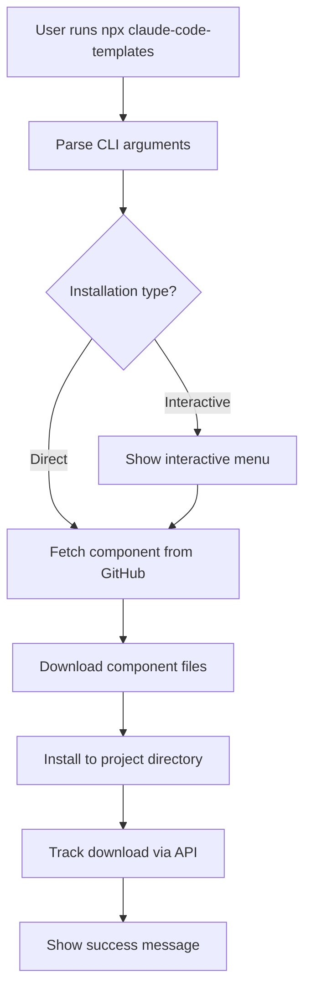

This guide provides an overview of the Claude Code Templates project architecture, including the CLI tool, component system, website, and infrastructure.

## Project Structure

```bash
claud-code-templates/
├── cli-tool/                    # CLI tool for component installation
│   ├── bin/                     # Executable scripts
│   ├── src/                     # Source code
│   │   ├── index.js            # Main CLI logic
│   │   ├── analytics/          # Analytics dashboard
│   │   ├── chats/              # Chat monitor
│   │   └── health-checks/      # Health check diagnostics
│   ├── components/             # Component library
│   │   ├── agents/             # AI specialists (400+)
│   │   ├── commands/           # Slash commands (225+)
│   │   ├── mcps/               # MCP integrations (65+)
│   │   ├── settings/           # Configuration files (60+)
│   │   ├── hooks/              # Automation triggers (39+)
│   │   └── skills/             # Modular capabilities
│   └── package.json            # CLI dependencies
├── docs/                        # Static website
│   ├── index.html              # Component browser
│   ├── components.json         # Component catalog (~2MB)
│   ├── blog/                   # Blog articles
│   └── js/                     # Vanilla JavaScript
├── api/                         # Vercel Serverless Functions
│   ├── track-download-supabase.js
│   ├── discord/                # Discord bot
│   └── claude-code-check.js    # Release monitoring
├── dashboard/                   # Astro dashboard (app.aitmpl.com)
│   ├── src/
│   │   ├── pages/              # Astro pages
│   │   ├── components/         # React islands
│   │   └── styles/             # Tailwind CSS
│   └── package.json
├── cloudflare-workers/         # Cloudflare Workers
│   ├── docs-monitor/           # Documentation monitoring
│   └── pulse/                  # Weekly KPI reports
├── scripts/                    # Build and utility scripts
│   ├── generate_components_json.py  # Catalog generation
│   └── deploy.sh               # Deployment automation
└── package.json                # Root package configuration
```

## CLI Tool Architecture

### Main Entry Point

Location: `cli-tool/src/index.js`

The CLI tool is a Node.js application that:

1. Parses command-line arguments using `commander`
2. Fetches component files from GitHub
3. Installs components to the user's project
4. Tracks downloads via API
5. Provides interactive installation mode

### Installation Flow



### Component System

#### Component Types

**Agents** (`cli-tool/components/agents/`)
- Format: Markdown with YAML frontmatter
- Installation: `.claude/agents/{name}.md`
- Purpose: AI specialists for specific domains

**Commands** (`cli-tool/components/commands/`)
- Format: Markdown with YAML frontmatter
- Installation: `.claude/commands/{name}.md`
- Purpose: Custom slash commands for workflows

**MCPs** (`cli-tool/components/mcps/`)
- Format: JSON
- Installation: `.mcp.json` (merged)
- Purpose: External service integrations

**Settings** (`cli-tool/components/settings/`)
- Format: JSON
- Installation: `.claude/settings.json` (merged)
- Purpose: Claude Code configuration

**Hooks** (`cli-tool/components/hooks/`)
- Format: JSON + optional scripts
- Installation: `.claude/settings.json` + `.claude/hooks/`
- Purpose: Automation triggers for events

**Skills** (`cli-tool/components/skills/`)
- Format: Markdown + references + scripts
- Installation: `.claude/skills/{name}/`
- Purpose: Modular capabilities (Anthropic format)

#### Component Categories

Components are organized by category:

```bash
agents/
├── development-team/           # Full-stack developers
├── domain-experts/            # Security, performance specialists
├── creative-team/             # Content creators, designers
├── business-team/             # Product managers, analysts
└── development-tools/         # Tool specialists, DevOps

commands/
├── testing/                   # Test generation, validation
├── utilities/                 # Code analysis, debugging
├── setup/                     # Environment setup
├── team/                      # Collaboration, planning
└── sync/                      # External tool integration

hooks/
├── git/                       # Git workflow automation
├── development-tools/         # File changes, formatting
├── testing/                   # Test execution
├── automation/                # Notifications, deployments
├── security/                  # Security scanning
└── performance/               # Performance monitoring
```

## Analytics Dashboard

Location: `cli-tool/src/analytics/`

Real-time monitoring dashboard for Claude Code sessions.

### Architecture

```bash
src/analytics/
├── core/                       # Business logic
│   ├── StateCalculator.js     # Conversation state detection
│   ├── ProcessDetector.js     # Running process detection
│   ├── ConversationAnalyzer.js # Message parsing
│   └── FileWatcher.js         # Real-time file monitoring
├── data/                      # Data management
│   └── DataCache.js          # Multi-level caching
├── notifications/             # Real-time communication
│   ├── WebSocketServer.js    # Server-side WebSocket
│   └── NotificationManager.js # Event-driven notifications
└── utils/                     # Utilities
    └── PerformanceMonitor.js # System health monitoring
```

### Features

- Real-time conversation monitoring
- State detection (active, idle, stopped)
- Process detection (running commands)
- Performance metrics
- WebSocket-based live updates
- Multi-level caching for performance

### Usage

```bash
# Start analytics dashboard
npm run analytics:start

# Access at http://localhost:3333

# API endpoints
GET  /api/health              # Health check
GET  /api/conversations       # List conversations
GET  /api/conversation/:id    # Get conversation details
POST /api/cache/clear         # Clear cache
GET  /api/refresh             # Refresh data
```

## Website Architecture

Location: `docs/`

Static website at [aitmpl.com](https://aitmpl.com) for browsing components.

### Data Flow

1. **Component Scanning**: `scripts/generate_components_json.py` scans `cli-tool/components/`
2. **Catalog Generation**: Generates `docs/components.json` with embedded content
3. **Website Loading**: Browser loads JSON and renders component cards
4. **Download Tracking**: Installation tracked via `/api/track-download-supabase`

### Component Catalog Format

```json
{
  "agents": [
    {
      "name": "frontend-developer",
      "category": "development-team",
      "description": "Frontend development specialist...",
      "content": "Full markdown content...",
      "downloads": 1234,
      "tools": ["Read", "Write", "Edit", "Bash"],
      "model": "sonnet"
    }
  ],
  "commands": [...],
  "mcps": [...],
  "settings": [...],
  "hooks": [...],
  "skills": [...]
}
```

## API Architecture

Location: `api/`

Vercel Serverless Functions for backend operations.

### Critical Endpoints

**`/api/track-download-supabase`**
- Tracks component downloads for analytics
- Used by CLI on every installation
- Database: Supabase (`component_downloads` table)

**`/api/discord/interactions`**
- Discord bot slash commands
- Features: `/search`, `/info`, `/install`, `/popular`

**`/api/claude-code-check`**
- Monitors Claude Code releases
- Vercel Cron: every 30 minutes
- Database: Neon (version tracking)

## Dashboard Architecture

Location: `dashboard/`

Astro + React + Tailwind dashboard at [app.aitmpl.com](https://app.aitmpl.com).

### Architecture

- **Framework**: Astro 5 with React islands
- **Auth**: Clerk (user collections)
- **Styling**: Tailwind v4
- **Data**: Fetches from `https://www.aitmpl.com/components.json`
- **API Proxy**: Proxies to main site API

### Directory Structure

```bash
dashboard/
├── src/
│   ├── pages/              # Astro pages
│   │   ├── index.astro    # Home page
│   │   └── api/           # API proxy routes
│   ├── components/        # React islands
│   │   ├── ComponentGrid.tsx
│   │   ├── SearchBar.tsx
│   │   └── CollectionManager.tsx
│   ├── layouts/           # Layout components
│   └── styles/            # Tailwind CSS
├── public/                # Static assets
└── package.json
```

## Cloudflare Workers

Location: `cloudflare-workers/`

Independent serverless functions on Cloudflare.

### docs-monitor

Monitors [code.claude.com/docs](https://code.claude.com/docs) for changes:
- Runs every hour
- Sends Telegram notifications
- Tracks documentation updates

### pulse

Weekly KPI reports:
- Runs Sundays at 14:00 UTC
- Collects metrics from multiple sources:
  - GitHub (stars, forks, commits)
  - Discord (members, messages)
  - Supabase (downloads)
  - Vercel (deployments)
  - Google Analytics (traffic)
- Sends consolidated Telegram report

## Deployment Architecture

### Vercel Projects

Two separate Vercel projects:

| Project | Domain | Root Directory | Purpose |
|---------|--------|----------------|----------|
| `aitmpl` | `www.aitmpl.com` | `/` | Main site + API |
| `aitmpl-dashboard` | `app.aitmpl.com` | `dashboard` | Dashboard app |

### CI/CD Pipeline

GitHub Actions (`.github/workflows/deploy.yml`):

- Changes in `docs/`, `api/`, or `vercel.json` → Deploy main site
- Changes in `dashboard/` → Deploy dashboard
- Auto-deploy on push to `main` branch

### Deployment Commands

```bash
# Deploy main site
npm run deploy:site

# Deploy dashboard
npm run deploy:dashboard

# Deploy both
npm run deploy:all
```

<Warning>
  Always use the deployer agent (`.claude/agents/deployer.md`) for deployments. It runs pre-deploy checks and handles the pipeline safely.
</Warning>

## Database Architecture

### Supabase

**Purpose**: Download tracking and analytics

**Tables**:
- `component_downloads` - Track component installations
  - `id`, `component_type`, `component_name`, `component_category`
  - `installed_at`, `user_id`, `project_id`

### Neon (PostgreSQL)

**Purpose**: Claude Code release monitoring

**Tables**:
- `claude_code_versions` - Version history
- `claude_code_changes` - Change tracking
- `discord_notifications_log` - Notification history
- `monitoring_metadata` - Monitoring state

## Security Architecture

### Environment Variables

All secrets stored in environment variables:

```bash
# Vercel
SUPABASE_URL
SUPABASE_SERVICE_ROLE_KEY
NEON_DATABASE_URL
DISCORD_BOT_TOKEN

# Cloudflare Workers
TELEGRAM_BOT_TOKEN
TELEGRAM_CHAT_ID
GITHUB_TOKEN
```

<Warning>
  NEVER hardcode secrets in code. Always use environment variables. See [Code Standards](/contributing/code-standards) for details.
</Warning>

### Path Security

- Use relative paths only
- No absolute paths in components
- No hardcoded home directories
- Use `$CLAUDE_PROJECT_DIR` for dynamic paths

## Performance Considerations

### Component Catalog

- Generated catalog is ~2MB (compressed)
- Loaded once and cached in browser
- Components filtered client-side for speed

### Analytics Dashboard

- Multi-level caching (memory + disk)
- WebSocket for real-time updates (not polling)
- Efficient file watching (chokidar)
- Performance monitoring built-in

### API Endpoints

- Serverless functions (fast cold starts)
- Database connection pooling
- Response caching where appropriate

## Monitoring and Observability

### Vercel Logs

```bash
# Monitor logs
vercel logs aitmpl.com --follow

# Check specific deployment
vercel logs <deployment-url>
```

### Health Checks

- Analytics dashboard: `GET /api/health`
- API endpoints: Built-in error logging
- Cloudflare Workers: Error tracking

### Metrics Tracking

- Component downloads (Supabase)
- Website traffic (Google Analytics)
- API usage (Vercel analytics)
- GitHub activity (pulse worker)

## Next Steps

<CardGroup cols={2}>
  <Card title="Component Guidelines" icon="check-circle" href="/contributing/component-guidelines">
    Best practices for creating components
  </Card>
  <Card title="Code Standards" icon="code" href="/contributing/code-standards">
    Coding conventions and style guide
  </Card>
  <Card title="Testing Workflow" icon="vial" href="/contributing/testing">
    How to test your contributions
  </Card>
  <Card title="Publishing Workflow" icon="rocket" href="/contributing/publishing">
    Complete publishing process
  </Card>
</CardGroup>
